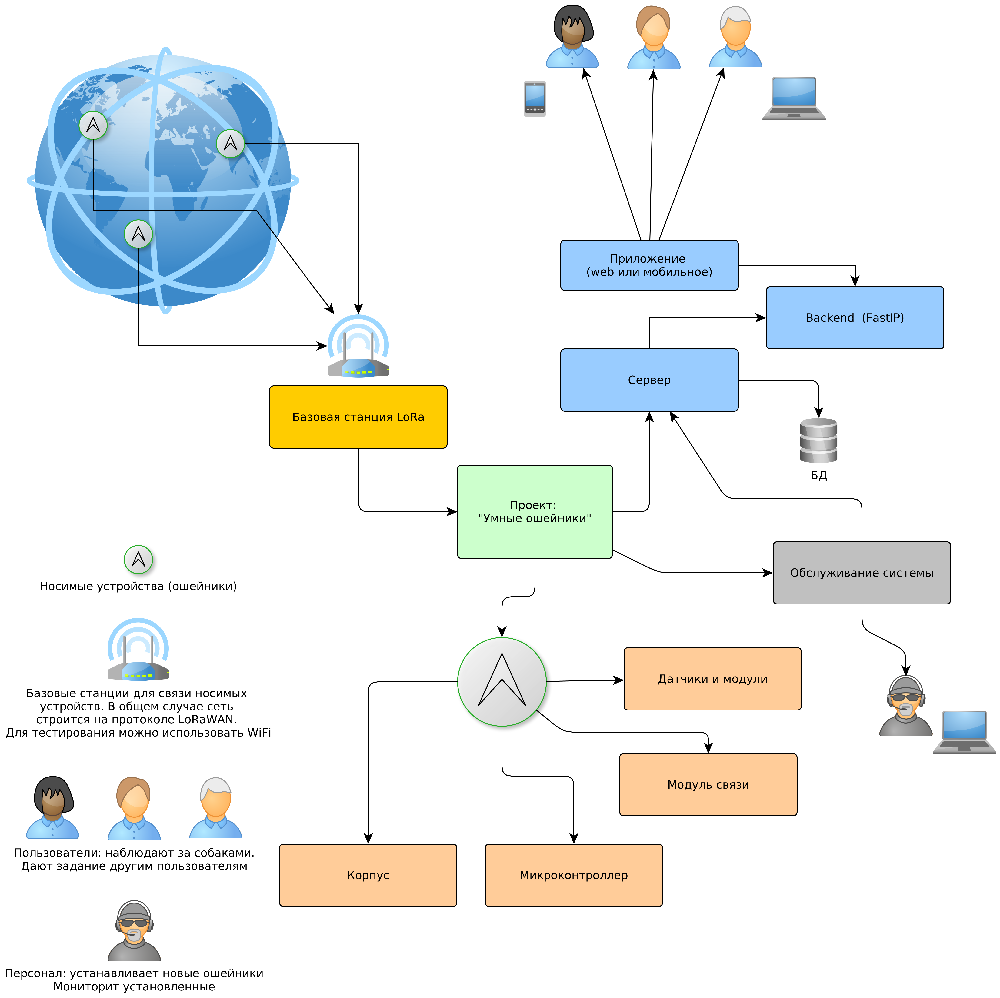
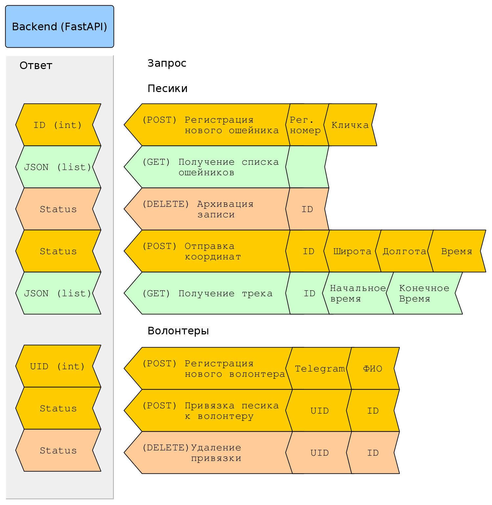

API для отслеживание собак по ошейникам
=======================================

**Данные репозиторий представляет собой часть учебного проекта по отслеживанию
собак с помощью ощейников с модулями GPS и мобильной связи. Часть деталей 
опущену в угоду лаконичности кода.** 

Конфигурация системы
--------------------

Система состоит из нескольких компонентов, которые представлены на рисунке ниже. 
Мобильная связь на схеме пердставлена LoRa, однако может быть использована и 
стандартная сотовая связь.

Данный репозиторий концентрируется на API на основе фреймоврка FastAPI. Мы 
реализуем следующие запросы (endpoint, "ручки"):

